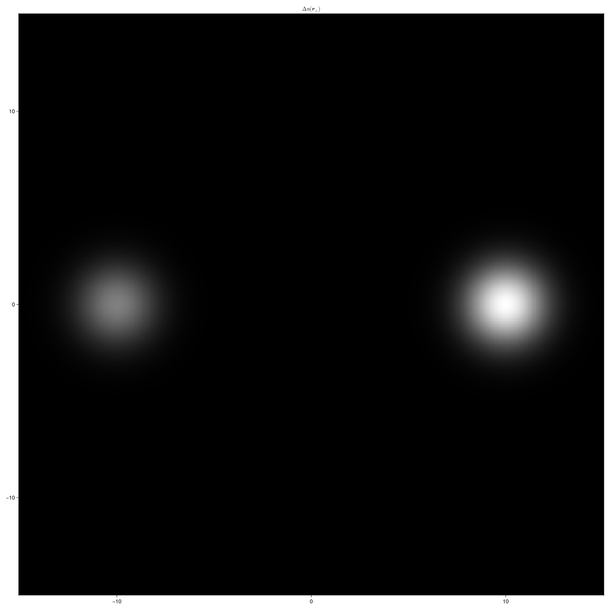
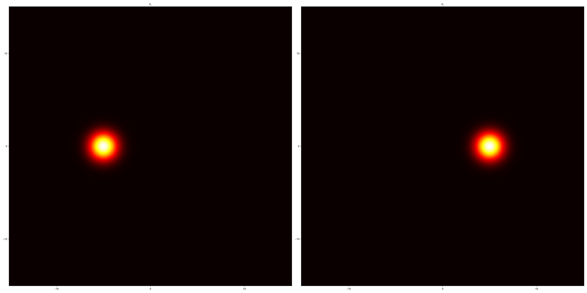

<div style="text-align: center;">

# Teoria de acoplamento de modos entre guias gaussianos

> #### **Resumo.**
>
>   Este documento apresenta a teoria de acoplamento de modos (CMT, do inglês *Coupled Mode Theory*)
>   aplicada a guias gaussianos. Revisamos aqui os resultados apresentados ao longo do
>   artigo *Coupled-mode theory for optical waveguides: an overview* da JOSAA
>   ([doi:10.1364/JOSAA.11.000963](https://doi.org/10.1364/JOSAA.11.000963)) onde uma
>   revisão da literatura acerca de CMT aplicada a guias de onda é apresentado.

</div>

```julia
using FFTW
using GLMakie
using LinearAlgebra: inv

const μm = 1.;
const nm = 1e-3μm;
const cm = 1e+3μm;

const n₀ = 1.5078;

const w₀ = 2.0μm;
const a₀ = 5.0μm;

const λ = 780.0nm;

const Δn_a, Δn_b = 2.2e-3, 1.1e-3;

x, y = -15μm:0.1μm:+15μm, -15μm:0.1μm:+15μm;
Z = 0μm:10μm:10cm;
```

$$
    \imath\cancel\lambda\frac{\partial}{\partial z}\Psi(\mathbf{r}_\perp,z) =
        \left[-\frac{\cancel\lambda^2}{2 n_0}\nabla_\perp^2 + \Delta n(\mathbf{r}_\perp)\right]\Psi(\mathbf{r}_\perp, z),  
$$

```julia
function ∇²(ψ)
    Fψ = fft(ψ)
    ξ_x = 2π * fftfreq(length(x), 1 / step(x))
    ξ_y = 2π * fftfreq(length(y), 1 / step(y))
    ∇² = [ξ_x^2 + ξ_y^2 for ξ_x in ξ_x, ξ_y in ξ_y]
    return ifft(∇² .* Fψ)
end;

function Δn(X, Y)
    _x, _y = [x / w₀ for x in X, _ in Y], [y / w₀ for _ in X, y in Y]

    _z_a = @. (_x - a₀) + 1im * _y
    _z_b = @. (_x + a₀) + 1im * _y

    return @. Δn_a * exp(-abs2(_z_a)) + Δn_b * exp(-abs2(_z_b))
end;

fig = Figure(size=(1600, 1600));

ax = Axis(fig[1, 1], title=L"\Delta{n}(\mathbf{r}_\perp)");

V = Δn(x, y);

heatmap!(ax, x, y, V, colormap=:bone);

save("waveguides.png", fig);
```

<div style="text-align: center;">
    
</div>

$$
    \Psi(\mathbf{r}_\perp, z) =
        \sum_n \mathrm{c}_n(z)\Phi_n(\mathbf{r}_\perp),  
$$

```julia
function gaussian(w₀, X, Y)
    _x, _y = [x / w₀ for x in X, _ in Y], [y / w₀ for _ in X, y in Y]

    _z = @. _x + 1im * _y

    A = 1 / sqrt(π * w₀^2)

    return @. A * exp(-abs2(_z))
end

fig = Figure(size=(3200, 1600));
axs = [
    Axis(fig[1, 1], title=L"\Psi_a"),
    Axis(fig[1, 2], title=L"\Psi_b")
];

Φ = [gaussian(w₀, x .+ a₀, y), gaussian(w₀, x .- a₀, y)];

heatmap!(axs[1], x, y, abs2.(Φ[1]), colormap=:hot);
heatmap!(axs[2], x, y, abs2.(Φ[2]), colormap=:hot);

save("heatmaps.png", fig);
```

<div style="text-align: center;">
    
</div>

$$
    \imath\cancel\lambda\sum_n \dot{\mathrm{c}}_n(z)\Phi_n(\mathbf{r}_\perp) =
        \sum_n \mathrm{c}_n(z) \left[-\frac{\cancel\lambda^2}{2 n_0}\nabla_\perp^2 + \Delta n(\mathbf{r}_\perp)\right]\Phi_n(\mathbf{r}_\perp)
$$

$$
    \imath\cancel\lambda \sum_n \dot{\mathrm{c}}_n(z)\Phi_n(\mathbf{r}_\perp) =
        \sum_n \mathrm{c}_n(z) \sum_m \beta_n^{(m)}\Phi_m(\mathbf{r}_\perp),
$$

$$
    \imath\cancel\lambda \sum_m \dot{\mathrm{c}}_m(z)\Phi_n(\mathbf{r}_\perp) =
        \sum_m \left(\sum_n \beta_n^{(m)}\mathrm{c}_n(z)\right)\Phi_m(\mathbf{r}_\perp),
$$

```julia
⊙(ϕ, ψ) = begin
    dS = step(x) * step(y);

    return round.(sum(conj.(ϕ) .* ψ), digits = 8) * dS;
end

P = [
    Φ[1] ⊙ Φ[1] Φ[1] ⊙ Φ[2];
    Φ[2] ⊙ Φ[1] Φ[2] ⊙ Φ[2];
];

λ_not = λ/2π;
λ_not² = λ_not^2;

B = [
    Φ[1] ⊙ (-λ_not²*∇²(Φ[1])/2n₀ + V*Φ[1]) Φ[1] ⊙ (-λ_not²*∇²(Φ[2])/2n₀ + V*Φ[2]);
    Φ[2] ⊙ (-λ_not²*∇²(Φ[1])/2n₀ + V*Φ[1]) Φ[2] ⊙ (-λ_not²*∇²(Φ[2])/2n₀ + V*Φ[2]);
];
```

$$
    \imath\cancel\lambda\mathrm{\hat P}\dot{\mathbf{c}}(z) = \mathrm{\hat B}\mathbf{c}(z),
$$

$$
    \imath\cancel\lambda\dot{\mathbf{c}}(z) = \mathrm{\hat P}^{-1}\mathrm{\hat B}\mathbf{c}(z) \equiv \mathrm{\hat H}\mathbf{c}(z),
$$

```julia
H = inv(P) * B;
```

$$
    \mathbf{c}(z) = \exp\left[-\imath\frac{\mathrm{\hat H}}{\cancel\lambda}z\right]\mathbf{c}(z = 0),
$$

```julia
U(z) = exp(-1im * H * z / λ_not);

A₀, B₀ = [1; 0], [0; 1];

fig = Figure(size = (800, 400));
axs = [
    Axis(fig[1, 1], title = L"\Psi_{z = 0} = \Psi_a"),
    Axis(fig[1, 2], title = L"\Psi_{z = 0} = \Psi_b")
];

hms = [
    heatmap!(
        axs[1],
        x, y, abs2.(Φ[1]);
        colormap = :hot
    ),
    heatmap!(
        axs[2],
        x, y, abs2.(Φ[2]);
        colormap = :hot
    )
];

record(fig, "CMT-propagation.gif", Z; framerate=30) do z
    P = U(z);
    A, B = P * A₀, P * B₀;

    hms[1][3][] = abs2.(A[1] * Φ[1] + A[2] * Φ[2]);
    hms[2][3][] = abs2.(B[1] * Φ[1] + B[2] * Φ[2]);
end
```

<div style="text-align: center;">
    <a href="CMT-propagation.gif">
        
    </a>
</div>
